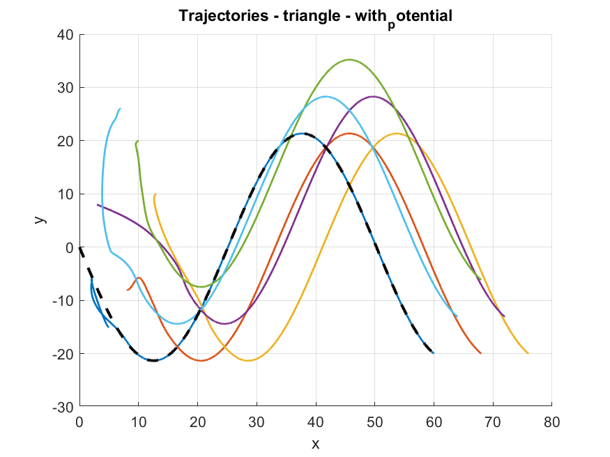
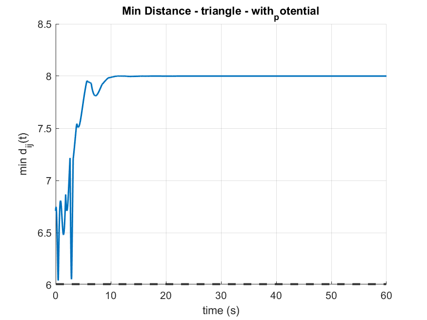
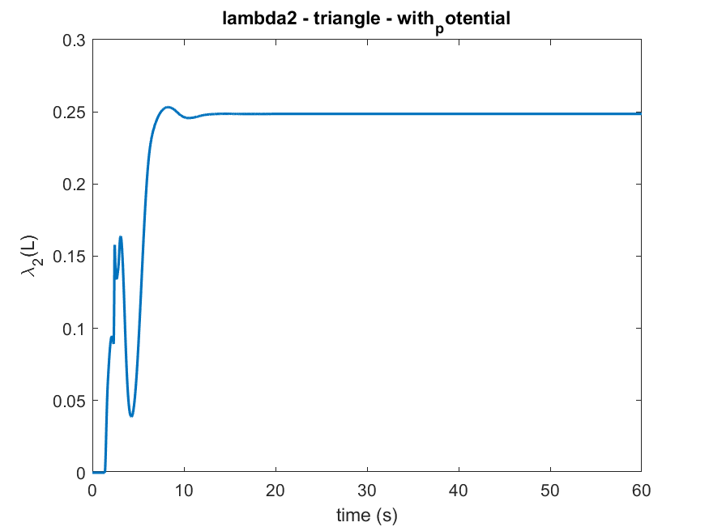
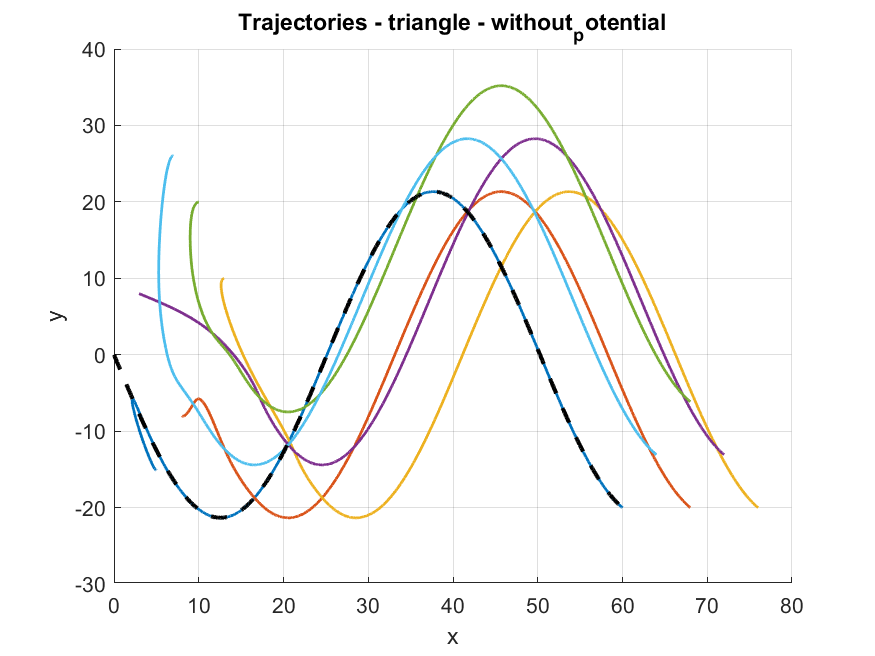
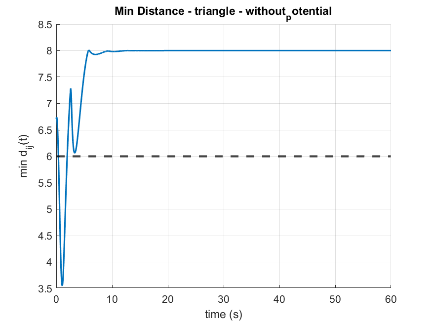
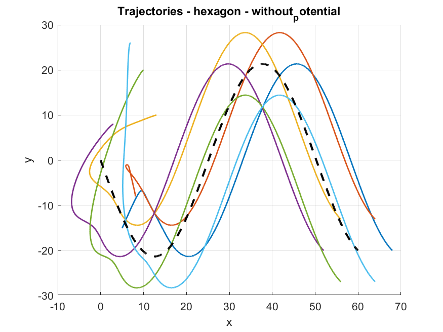
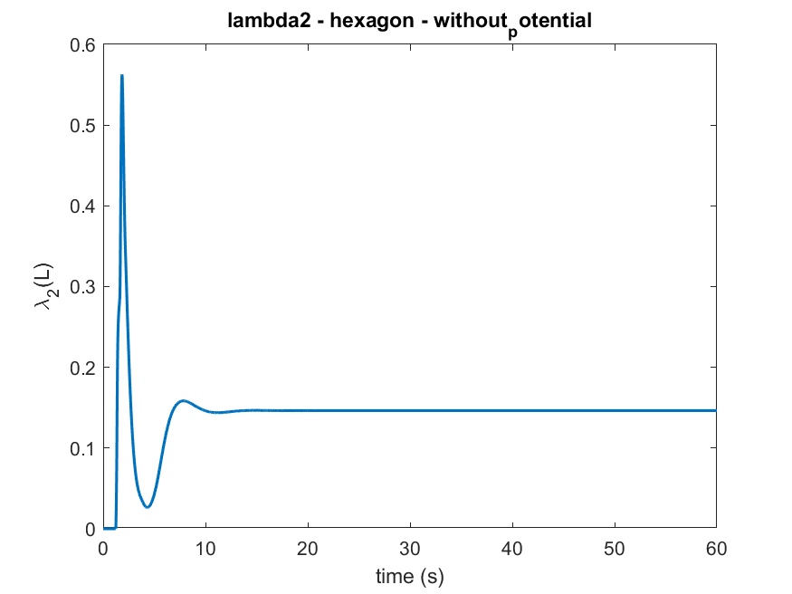

# Multi-Agent Formation Control Simulation

MATLAB implementation of a multi-agent formation tracking simulation inspired by the paper:

> **Formation Tracking Control for Multi-Agent Systems with Collision Avoidance and Connectivity Maintenance**

This repository contains an educational replication-style simulation for formation tracking in a double-integrator multi-agent system. The current version focuses on the base scenario, including formation keeping, reference tracking, graph-based neighbor interactions, collision-avoidance behavior, and connectivity monitoring.

A more advanced scenario is planned to be added later.

---

## Overview

The project simulates a group of agents that follow a virtual leader trajectory while maintaining a desired geometric formation. The interaction topology is built from distance-based neighbor relations, and the simulation logs safety, connectivity, trajectory, velocity, and control-input signals.

The implementation currently includes:

- 6-agent 2D formation tracking
- Triangle and hexagon formation templates
- Weighted graph construction using a smooth bump function
- Laplacian matrix and algebraic connectivity calculation
- Reference trajectory tracking
- Distributed formation-keeping control
- Optional potential/action term for collision avoidance and connectivity maintenance
- MATLAB result plots and `.mat` data export

---

## System Model

Each agent is modeled as a double-integrator system:

```text
x_dot = v
v_dot = u
```

where:

- `x` is the agent position,
- `v` is the agent velocity,
- `u` is the control input.

The simulation uses discrete-time Euler integration with a fixed time step defined in `params.m`.

---

## Control Structure

The total control input is composed of three main terms:

```text
u = u_tracking + u_formation + u_potential
```

### 1. Reference tracking term

The tracking term drives each agent's formation-relative position toward the virtual leader trajectory while matching the reference velocity and acceleration.

Implemented in:

```text
tracking_term.m
navigator.m
```

### 2. Formation-keeping term

The formation term reduces relative formation errors between neighboring agents using the weighted adjacency matrix.

Implemented in:

```text
formation_term.m
formation_targets.m
```

### 3. Potential/action term

The optional potential term is used to influence collision avoidance and connectivity maintenance through distance-based interactions.

Implemented in:

```text
potential_term.m
action_f.m
```

---

## Graph and Connectivity

At each simulation step, the code computes:

- Pairwise distances between agents
- Binary adjacency matrix
- Weighted adjacency matrix
- Degree matrix
- Graph Laplacian
- Algebraic connectivity value `lambda2`

Implemented in:

```text
adjacency_laplacian.m
bump.m
get_lambda2.m
neighbors.m
```

The algebraic connectivity `lambda2` is used as a graph connectivity indicator. A positive value generally indicates that the communication graph is connected.

---

## Simulation Scenarios

The current base version runs the following cases:

| Formation | Potential term | Purpose |
|---|---:|---|
| Triangle | Enabled | Formation tracking with collision/connectivity behavior |
| Triangle | Disabled | Comparison case without potential/action term |
| Hexagon | Disabled | Additional formation template case |

The scenario selection and result generation are handled in:

```text
main.m
simulate.m
```

---

## Repository Structure

```text
.
├── action_f.m
├── adjacency_laplacian.m
├── bump.m
├── formation_targets.m
├── formation_term.m
├── get_lambda2.m
├── init_condition.m
├── main.m
├── navigator.m
├── neighbors.m
├── params.m
├── plot_pack_like_paper.m
├── potential_term.m
├── simulate.m
├── tracking_term.m
└── results/
    └── run_2026-02-17_08-37-31/
        ├── triangle/
        │   ├── with_potential/
        │   └── without_potential/
        └── hexagon/
            └── without_potential/
```

---

## How to Run

1. Open MATLAB.
2. Set the current folder to the repository root.
3. Run:

```matlab
main
```

The script will:

- load parameters from `params.m`,
- initialize positions and velocities,
- run the selected formation scenarios,
- save result data under `results/`,
- generate trajectory, safety, connectivity, velocity-error, and control-input plots.

---

## Parameters

Main simulation parameters are defined in `params.m`.

Important parameters include:

| Parameter | Meaning |
|---|---|
| `P.n` | Number of agents |
| `P.m` | Workspace dimension |
| `P.dt` | Simulation time step |
| `P.T` | Total simulation time |
| `P.R` | Sensing / communication radius |
| `P.r_in` | Inner safety radius |
| `P.r_out` | Outer interaction radius |
| `P.d_safe` | Minimum admissible inter-agent distance |
| `P.k1`, `P.k2` | Formation control gains |
| `P.kappa` | Potential/action term strength |
| `P.use_potential` | Enables or disables the potential term |

---

## Results

The simulation saves plots for each scenario, including:

- agent trajectories,
- minimum inter-agent distance,
- number of graph edges,
- algebraic connectivity `lambda2`,
- velocity tracking error,
- control input components.

Example result folders:

```text
results/run_2026-02-17_08-37-31/triangle/with_potential/
results/run_2026-02-17_08-37-31/triangle/without_potential/
results/run_2026-02-17_08-37-31/hexagon/without_potential/
```

### Triangle formation with potential term







### Triangle formation without potential term





### Hexagon formation without potential term





---

## Console Summary

For each scenario, `main.m` prints a short numerical summary, including:

```text
min(minDist)
violation time
min(lambda2)
max(lambda2)
number of safety violations
```

The corresponding data is also saved in:

```text
data.mat
badTimes.mat
```

---

## Notes on Reproducibility

The initial velocities are randomized using a fixed random seed defined in `params.m`, so the simulation is reproducible unless the parameters are changed.

Generated result folders are timestamped automatically.
---

